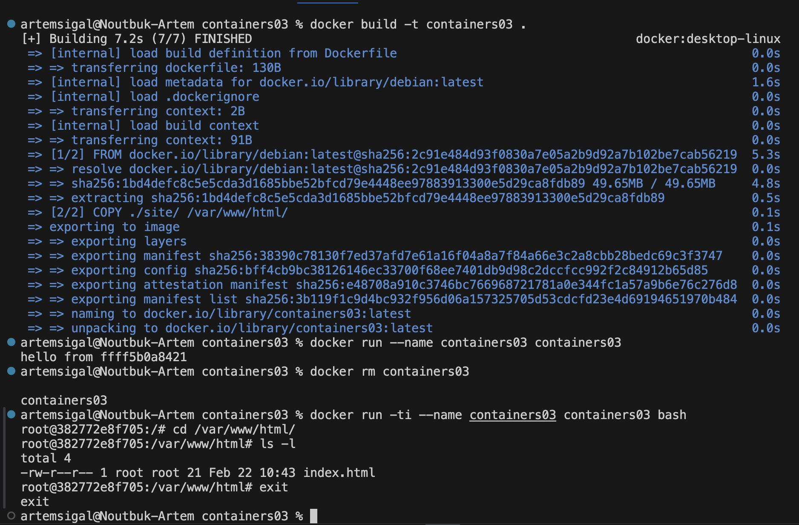

# Лабораторная работа №3. Создание Docker-образа
## Цель работы
Научиться создавать Docker-образ и запускать контейнер.
## Задание
Создать Dockerfile, собрать образ и протестировать контейнер.
## Описание выполнения:
- Создан Dockerfile на основе debian:latest
- Добавлена папка site с файлом index.html
- Выполнена сборка через docker build
- Запущен контейнер
- Проверено наличие файла в /var/www/html
## Ответы: 
1. Сколько времени создавался образ?
Весь образ создавался у меня 6 секунд.
2. Что было выведено в консоли?
`hello from ffff5b0a8421`
3. Что выводится на экране?
`total 4 -rw-r--r-- 1 root root 21 Feb 22 10:43 index.html`
## Вывод
Был создан Docker-образ и успешно запущен контейнер.
Изучена работа команд docker build и docker run.
## Используемые источники
Moodle doc: IWNO3: Первый контейнер
